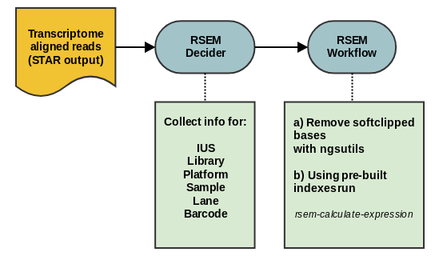

# RSEM

RSEM is a software package for estimating gene and isoform expression levels from RNA-Seq data. It has support for multi-threaded computation, can run on single-end and paired-end data and may produce statistic values in support of it's expression analysis. For visualization, It can generate BAM and Wiggle files in both transcript-coordinate and genomic-coordinate. For visualization, user may use RSEM-made bam and wiggle files with UCSC Genome browser or IGV browser from Broad Institute. RSEM can also make transcript read depth plots in pdf format. For this workflow, only limited subset of RSEM toolkit is used. This workflow provides a building block for RNAseq data analysis pipelines.

Steps implemented:

* Removing soft-clipped bases from input bam file (ngsutils, bamutils executable)
* Analyzing transcript expression profile

### Output

    ***isoforms.results - File containing isoform level expression estimates.
    ***genes.results    - File containing gene level expression estimates.
    ***transcript.bam   - File with additional ZW:f:value, where value is a 
                          single precision floating number representing the posterior probability.
                          
## Workflow Options

Parameter|Value|Description
---|---|---
output_dir | seqware-results | A standard SeqWare parameter specifying the sub-directory where the output files will be provisioned
output_prefix | \./ | A standard SeqWare parameter specifying the root directory where the output files will be provisioned
manual_output | false | Whether or not to use manual output. When false, a random integer will be inserted into the path of the file in order to ensure uniqueness
rsem_dir | bundled RSEM | Path to RSEM directory
bamutils | bundled ngsutils | Path to bamutils executable from ngsutils package
index_dir | | Path (including prefix of the files) for RSEM indexes
input_file | | Input Aligned.toTranscriptome.out.bam file produced with STAR workflow
rsem_threads | 6 | Threads used by RSEM
ngsutils_mem_mb | 8000 | Memory allocated to ngsutils job (removing soft-clipped bases)
ngsutils_pythonpath | | value to set the PYTHONPATH environment variable, the second part should not be touched
rsem_mem_mb | 10000 | Memory allocated to RSEM main job, in Mb
rsem_strandedness | none | This depends on sequencing protocol used to produce the data. Should be set to reverse with TruSeq Stranded protocol (possible values reverse, forward and none)
provision_rsem_bam_file | true | Optional flag to control provisioning of RSEM bam file (may be set to false to reduce the footprint in the filesystem)
additionalRSEMParams | | Pass additional RSEM parameters for rsem-calculate-expression, if needed

## Decider Options

The decider will process STAR output and if it can locate .bam alignments in transcript coordinates it will assembe configuration for a RSEM workflow that should produce a number of output files with transcript (or gene) expression estimates.

Parameter | Value | Description
---|---|---
output-dir | seqware-results | Optional: the folder to put the output into relative to the output-path
output-prefix | ./ | Optional: the path where the files should be copied to after analysis
manual-output | false | Set the manual output either to true or false
queue | | SGE cluster queue
index-dir | | path of RSEM indexes generated with rsem-prepare-reference
rsem-threads | 6 | Optional: RSEM threads
rsem-mem-mb | 10000 | RSEM allocated memory, Mb
rsem-strandedness | none | Strandedness parameter, should be set to reverse for TruSeq stranded protocols
ngsutils-mem-mb | 8000 | ngsutils allocated memory Mb
ngsutils-pythonpath | | value to set the PYTHONPATH environment variable, the second part should not be touched
additionalRsemParams | | Optional: RSEM additional parameters
template-type | | Optional template type, use to limit the analysis only to the specified subset 
provision-rsem-bam-file | true | Optional flag to instruct the workflow to provision (or not) the RSEM bam file
verbose | false | enable more verbosity when running Decider
